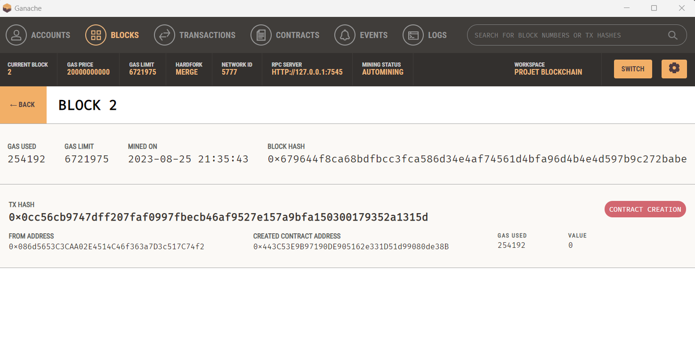
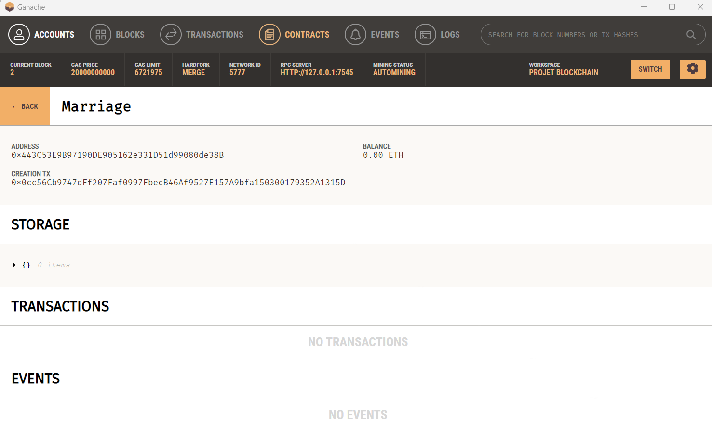

## Consignes TP a rendre:

- creer un smart contract qui permet de creer un mariage entre deux personnes
- creer un test pour ce smart contract
- deployer le smart contract sur ganache
- deployer le smart contract sur sepolia // pas eu le temps beaucoup de mal a le faire 
- creer une application web qui permet d'interagir avec le smart contract, a l'aide de web3js ou ethersjs

## N'oubliez pas de preciser sur Github :

- l'adresse du smart contract deploye sur ganache (ou un screenshot)

L'adresse du smart Contract deploye sur ganache est 0x443C53E9B97190DE905162e331D51d99080de38B

- l'adresse du smart contract deploye sur sepolia
Pas 
- l'adresse du compte qui a permis le deploiement sur ganache et/ou sepolia

L'adresse du compte qui a permis le deploiement est :   0x086d5653C3CAA02E4514C46f363a7D3c517C74f2

