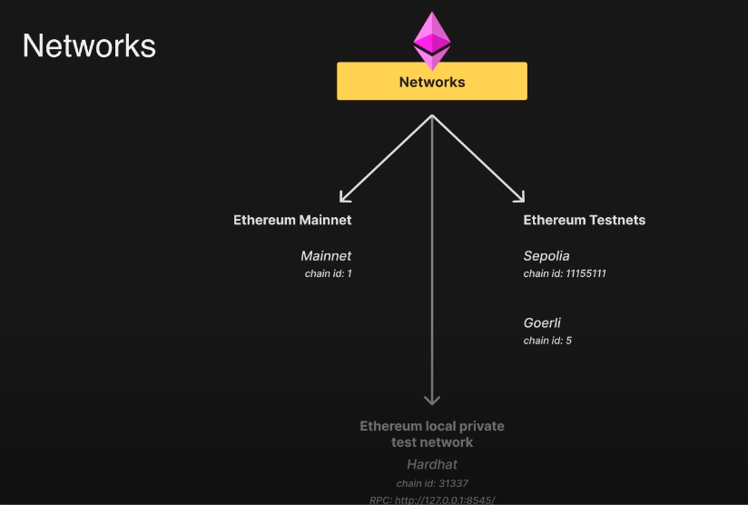

# Blockchain EVM : ETH

## Les wallets

Une solution de stockage digitale qui permet de stocker de mainere securisee des cles publiques et privees, et de signer des transactions.

Un crypto-wallet est un logiciel capable de generer une cle privee et de la stocker de maniere securisee. Cette cle privee va permettre la generation d'une cle pblique. L'adresse publique de votre wallet est alors les 20 derniers bytes de la cle publique hashee auquel on a ajoute 0x au debut.

Vous pouvez alors partager publiquement cette adresse afin de recevoir de l'Ethereum!

C'est une bonne pratique de stocker la cle privee sur differents supports tres securise.

La cle privee est utilisee afin de signer les transactions sur la blockchain et determine l'identite on chain.

Hot Wallets : en ligne (activite ++)

Cold wallets : completement hors ligne (holding)

## Les transactions

Types de comptes sur Eth :

- EOA : Externally-owned account (private/public key)
- Contract account (pas de cle privee, code managed)
- validator account


Une transaction va modifier l'etat de la blockchain Eth.

Voici de quoi se compose une transaction type :


- from: l'adresse publique d'origine
- to: l'adresse publique de destination
- value: qte d'eth (en Wei)
- data: normalement vide dans le cas d'une envoi simple d'ETH
- nonce: valeur associe a l'adresse d'origine et est incremente a chaque transaction, permet d'eviter les duplicatas sur la blockchain

- gasLimit:
- maxFeePerGas:
- maxPriorityFeePerGas:

Le gas represente les frais necessaires a la bonne execution de la transaction (en Gwei)

- signature: cree par votre wallet ou le smart contract avec lequel on interagit, une valeur generee avec la cle privee du wallet a l'origine de la transaction. Permet de s'assurer que la personne a l'origine de la transaction possede un acces a la cle privee.op

## EVM (ethereum virtual machine)

Un environnement (sandbox) qui permet d'executer les smarts contracts sur la blockchain ETH. C'est le squelette de l'ecosysteme applicatif de la blockchain Ethereum. L'EVM fournit un env securise et decentralise pour valide et executer des smartcontract.
L'EVM agit sur le reseau eth, elle est donc aussi decentralisee.

L'EVM utilise une serie d'instruction appelee Opcodes qui lui permet d'executer les smartcontracts :


Chaque noeud du reseau est capable d'analyser ces instructions :


Les smart contracts sont quant a eux ecrits dans un langage de plus haut niveau comme le Solidity, qui sera alors compile en bytecode EVM :


Le bytecode sera alors execute par l'EVM lors du deploiement d'un smartcontract par exemple:


Ce fameux bytecode peux etre utilise en envoyant des transactions a l'adresse publique du smart contract deploye
Le Gas sera utilise tout au long de ces process afin de limiter la quantite de ressource qu'un smart contract peut consommer. Le Gas represente un moyen de paiement pour la puissance de calcul d'un smart contract.

En resume l'EVM est une machine virtuelle decentralisee composee de plusieurs milliers d'ordinateurs... Elle permet de faire tourner tout le code deploye sur la blockchain ethereum.
L'EVM permet aux developppeurs d'ecrire des smart contracts et de produire des dApps.

## Les smart contracts (Rappel de solidity)

Une fois deploye un smart contract se comporte comme un compte sur la blockchain avec une structure un peu particuliere :


ABI (Application binary interface):

C'est une specification qui decrit l'interface d'un smart contract avec le monde exterieur (le web par exemple!)
Rappelons nous qu'un smart contract deploye est en bytecode

En resume, l'ABI est une description des variables et fonctions exposees par un smart contract une fois deploye.

Afin de creer une application qui interagit avec la blockchain tout ce dont un dev a besoin c'est :

- l'adresse publique d'un smart contract
- son ABI

## GAS


Modele de calcul des frais d'une transaction :

```javascript
gas utilise * (frais de base + frais de priorite)
```

Les frais de base (base fee) sont fixes par le blockchain
Les frais de prio sont fixes par l'utilisateur (priority fee) : une sorte de pourboire, un validateur aura tendance a faire passer en premier les transactions avec des frais de priorite plus elevee, car sa remuneration sera plus elevee...

La limite de Gas qui est la quantite de totale de Gas necessaire a la completion totale de la transaction est calculee en avance afin de s'assurer que la quantite de Gas est suffisante.

## Le reseau ETH: noeuds et clients

Comment envoie-t-on une requete au reseau ?

Il faut un moyen d'interagir avec les noeuds du reseau, mais qu'est-ce qu'un noeud ? ?

Un pc devient un noeud s'il fait tourner les couches consensus (Beacon node, POS) et d'execution du reseau ETH


On distingue differents types de noeuds : - un noeud complet (full node) - un noeud leger (light node) - un noeud archive (archive node)


Executer un noeud vous permet d'interagir avec la blockchain de facon privee et plus securisee. Cela contribue aussi la robustesse du reseau!

Il existe divers clients qui vous permettent de faire tourner votre propre noeud, le plus populaire est sans doute Geth.

Comment communiquer avec la blockchain quand on ne fait pas tourner son propre noeud ???

JSON-RPC API : remote procedure call


Un dev devra envoye des requetes vers un endpoint d'api JSON-RPC publique ou prive

Il existe des fournisseurs de JSON-RPC prives tels qu'Infura.

## Les reseaux

Ce sont des environnements differents qui permettent d'accomplir des buts differents :

- mise en production
- tests
- developpement

Les comptes metamasks peuvent se connecter a tous ces reseaux !



## Les autres BC EVM based

BNB MATIC
